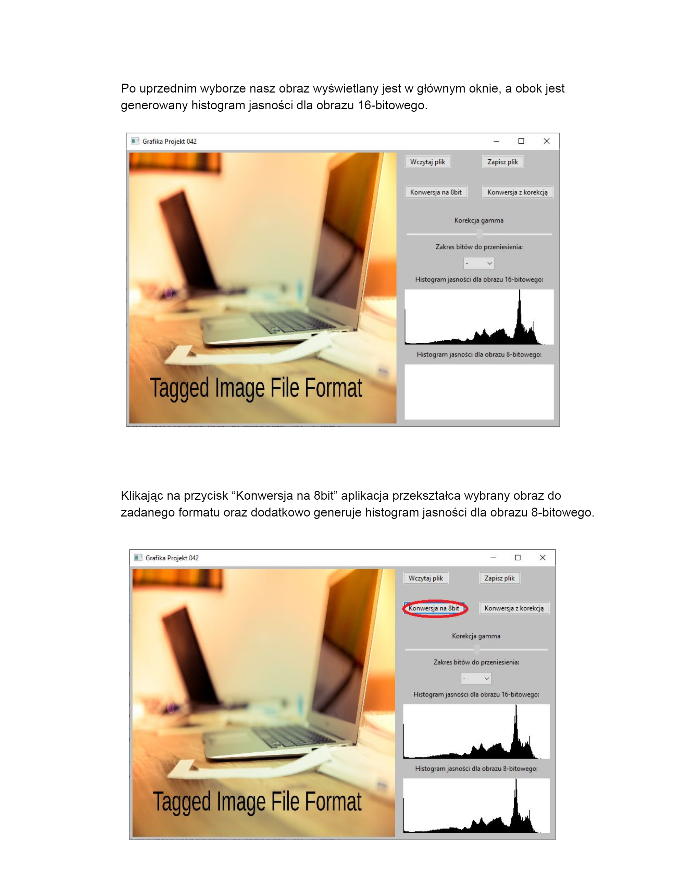

# Semester project for the Basics of Computer Graphics classes
## The main goal of the app is to handle different ways of converting TIFF files from 16-bit to 8-bit.

[Documentation](./GrafikaProjekt/DOC/42_Dokumentacja.pdf)
